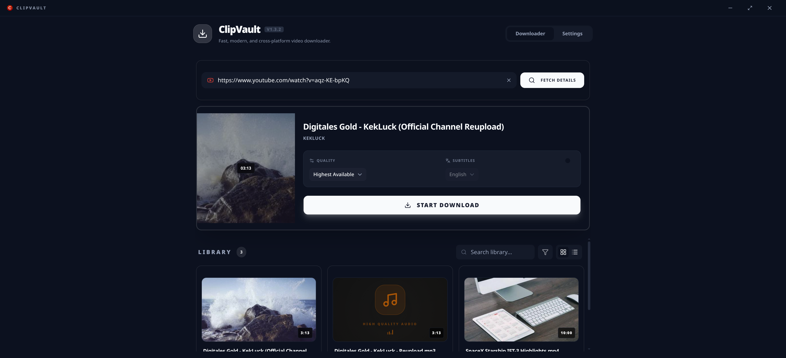
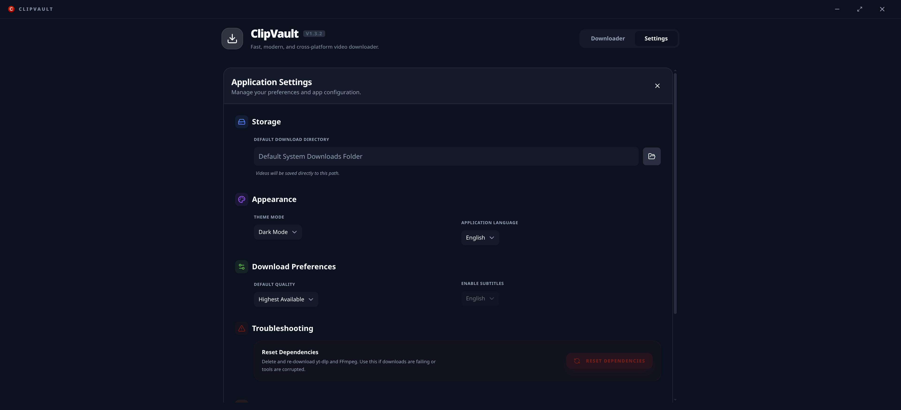
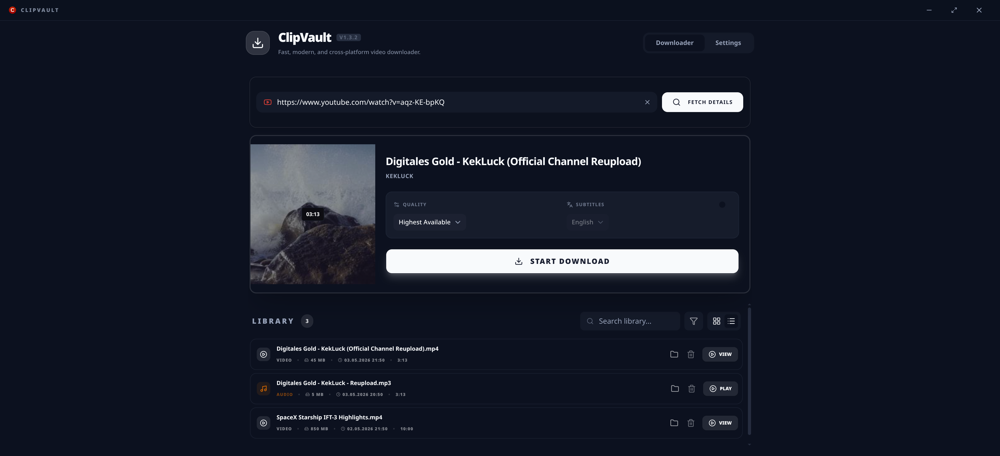

# ClipVault

ClipVault is a modern, high-performance desktop application built with Electron and Vue 3 that serves as a powerful frontend for `yt-dlp`. It provides a streamlined, user-friendly interface for downloading videos and audio from YouTube other supported platforms.

## 📸 Screenshots

<table align="center">
  <tr>
    <td align="center">
      <br>
      <em>Main Window, Starting Download</em>
    </td>
    <td align="center">
      <br>
      <em>Settings View</em>
    </td>
  </tr>
  <tr>
    <td align="center">
      <br>
      <em>Visual Library with Thumbnails</em>
    </td>
    <td align="center">
      <br>
      <em>Compact Shortlist View</em>
    </td>
  </tr>
</table>

## Key Features

- **Broad Compatibility**: Leverage the power of `yt-dlp` to download from a vast range of websites beyond just YouTube.
- **Modern User Experience**: A clean, responsive interface built with Vue 3, Tailwind CSS, and shadcn-vue components.
- **High-Quality Video Downloads**: Download videos in various resolutions up to 4K/8K. Supports popular formats like MP4, MKV, and WebM.
- **Audio-Only Downloads**: Extract high-quality MP3 audio from any video. Audio files are automatically named with an `-audio-only` suffix to prevent conflicts with video versions.
- **Smart Quality Selection**: Choose between highest available quality or specific remuxed streams.
- **Library Filtering & Visualization**:
  - **Dynamic Filters**: Easily filter your library to show All Files, Video only, or Audio only.
  - **Sleek Audio Cards**: Audio files feature a dedicated "black card" design with animated visualizers and music icons.
  - **Context-Aware Controls**: Labels dynamically switch between "Play" (for audio) and "View" (for video).
- **Automated Dependency Management**: ClipVault automatically handles the setup and updates for `yt-dlp` and `FFmpeg` on first run.
- **Multi-Audio Support**: Select your preferred audio language (e.g., AI-dubbed tracks) for YouTube downloads.
- **Integrated Library**: Track and manage your download history and local library directly within the application.
- **Persistent Settings**: Custom download directories and preferences are managed via a secure local store.

## Installation

### Binary Downloads

You can download the latest pre-built binaries for your platform from the [v1.4.2 Release Page](https://github.com/medianetic/ClipVault/releases/tag/v1.4.2).

#### Windows
- [**ClipVault-Setup-1.4.2.exe**](https://github.com/medianetic/ClipVault/releases/download/v1.4.2/ClipVault-Setup-1.4.2.exe) (Installer)
- [**ClipVault-1.4.2.exe**](https://github.com/medianetic/ClipVault/releases/download/v1.4.2/ClipVault-1.4.2.exe) (Portable)

#### macOS
- [**ClipVault-1.4.2.dmg**](https://github.com/medianetic/ClipVault/releases/download/v1.4.2/ClipVault-1.4.2.dmg) (Intel & Apple Silicon)
- [**ClipVault-1.4.2-mac.zip**](https://github.com/medianetic/ClipVault/releases/download/v1.4.2/ClipVault-1.4.2-mac.zip)

#### Linux
- [**ClipVault-1.4.2.AppImage**](https://github.com/medianetic/ClipVault/releases/download/v1.4.2/ClipVault-1.4.2.AppImage)
- [**clipvault_1.4.2_amd64.deb**](https://github.com/medianetic/ClipVault/releases/download/v1.4.2/clipvault_1.4.2_amd64.deb) (Debian/Ubuntu)
- [**clipvault-1.4.2.x86_64.rpm**](https://github.com/medianetic/ClipVault/releases/download/v1.4.2/clipvault-1.4.2.x86_64.rpm) (Fedora/RedHat)

### Building from Source

To build ClipVault manually, ensure you have [Node.js](https://nodejs.org/) (LTS) installed on your system.

1. **Clone the repository**
   ```bash
   git clone https://github.com/medianetic/ClipVault.git
   cd ClipVault
   ```

2. **Install dependencies**
   ```bash
   npm install
   ```

3. **Build the application**
   ```bash
   # Build for your current platform
   npm run build
   ```

The installer will be generated in the `release/` directory.

## Development

ClipVault is built using a modern frontend stack integrated with Electron.

### Tech Stack

- **Framework**: Electron
- **Frontend**: Vue 3 (Composition API)
- **Build Tool**: Vite
- **Styling**: Tailwind CSS & shadcn-vue
- **Language**: TypeScript
- **Storage**: electron-store

### Commands

- `npm run dev`: Starts the Vite development server and launches the Electron application with hot-reload enabled.
- `npm run build`: Compiles the frontend assets, transpiles the Electron main process, and packages the app using electron-builder.
- `npm run preview`: Previews the production build of the frontend.

## Project Structure

- `electron/`: Main process logic, IPC handlers, and binary management.
- `src/`: Vue 3 renderer process (UI components, styling, and state).
- `public/`: Static assets for the application.

## Contributing

Contributions are welcome. Please feel free to submit a Pull Request or open an issue for feature requests and bug reports.

## Author

- **Nick Weschkalnies** - [@medianetic](https://github.com/medianetic) - [nick@weschkalnies.de](mailto:nick@weschkalnies.de)

## Support

😊 If you like, you can <a href="https://buymeacoffee.com/weschkalnies">buy me a coffee</a>

## License

This project is licensed under the MIT License - see the [LICENSE](LICENSE) file for details.
